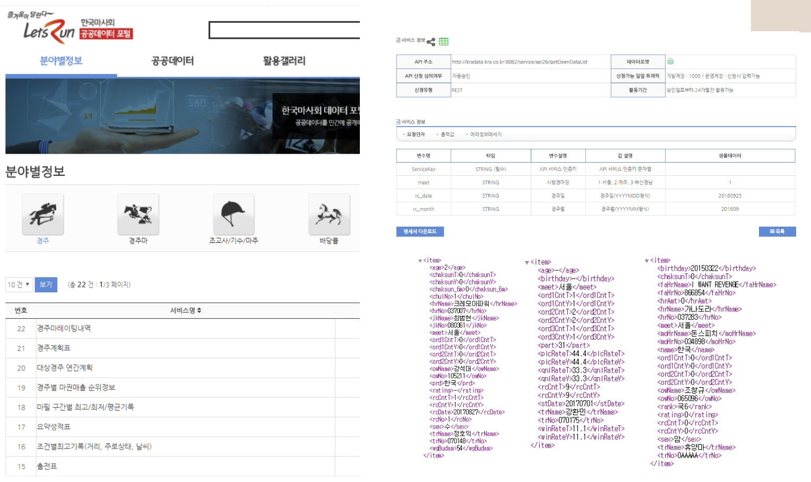
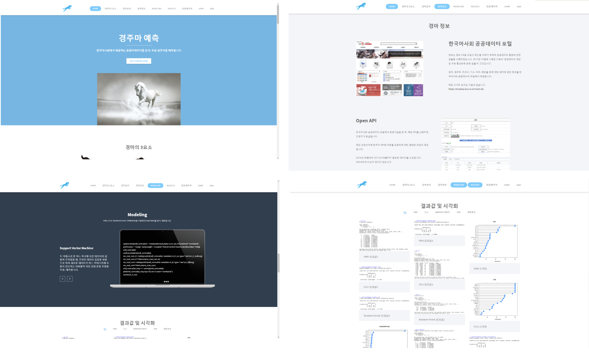
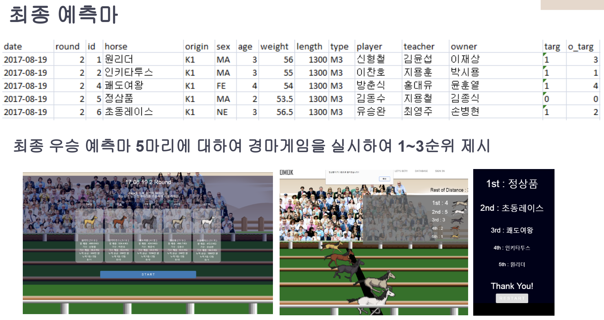

# Prediction of the winning racehorse
## Summary
>Analyzed public big data using KNN, C5.0, Random forest, svmRadial, and suggested the best options to bet on horse racing
>Presented visualizations, and results on a website, and offered a horse racing game following the result

## Skill Set
>Used Python, R, JavaScript, JQuery, Bootstrap, HTML5, CSS

## Screenshots

