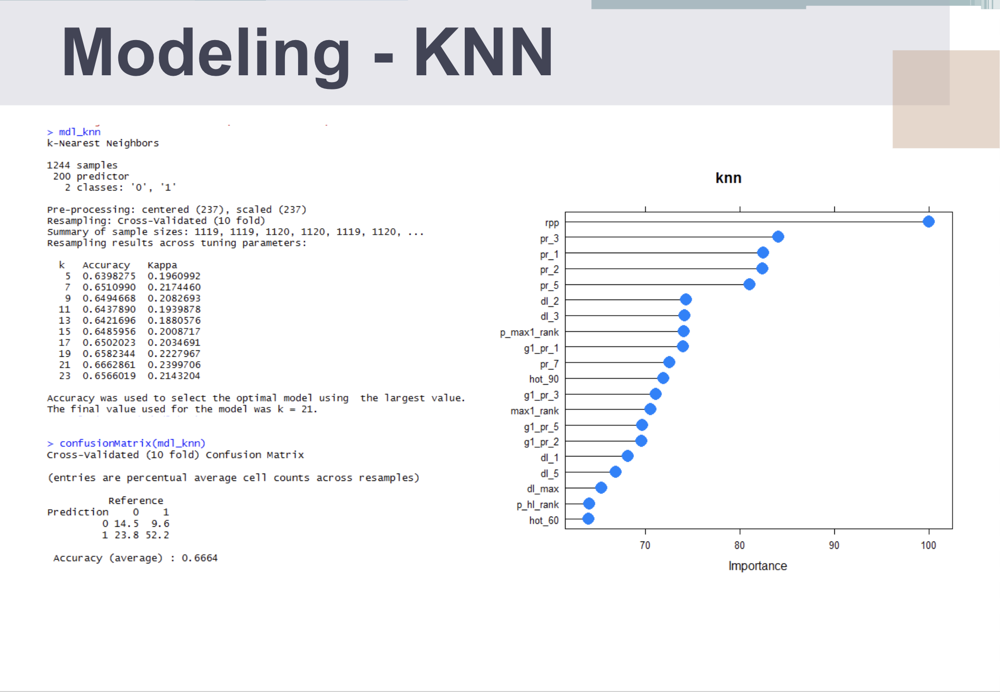

# Prediction of the winning racehorse
## Summary
>Analyzed the public big data of the horse racing using KNN, Decision tree, Random forest, SVM, and predicted the winning racehorse
>Collected, Extracted, Transformed, Loaded(ETL) the public big data, and presented visualizations and results on a website

## Skill Set
>Used R, JavaScript, JQuery, Bootstrap, HTML5, CSS

## Screenshots

